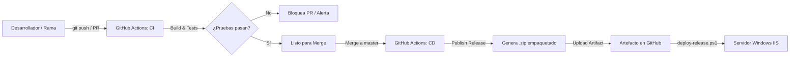

# Guía de CI/CD con GitHub Actions - Blanquita

Esta guía explica en detalle el funcionamiento, configuración y uso de la canalización de **Integración Continua (CI)** y **Despliegue Continuo (CD)** implementada para el sistema Blanquita (.NET 10 y Blazor Server).

---

## 1. Visión General de la Arquitectura



La canalización se divide en dos flujos de trabajo independientes dentro de `.github/workflows/`:
1. **CI (`ci.yml`)**: Valida que cualquier cambio en ramas o Pull Requests compile y supere el 100% de las pruebas unitarias e integración.
2. **CD (`cd.yml`)**: Se ejecuta automáticamente al incorporar cambios a la rama `master` (o manualmente vía `workflow_dispatch`), compila la aplicación web para producción, valida los archivos esenciales para IIS, crea un paquete `.zip` listo para desplegar y lo publica en los artefactos de la ejecución y/o en GitHub Releases.

---

## 2. Flujo de Integración Continua (CI)

- **Archivo**: `.github/workflows/ci.yml`
- **Disparadores**:
  - `pull_request` dirigidos a las ramas `master` o `main`.
  - `push` a cualquier rama de desarrollo (`feature/**`, `fix/**`, `refactor/**`, etc.).
  - Ejecución manual desde la interfaz de GitHub Actions (`workflow_dispatch`).
- **Entorno de ejecución**: `windows-latest` con el SDK de .NET 10.x.
- **Pasos ejecutados**:
  1. Descarga del código (`actions/checkout@v4`).
  2. Instalación del SDK de .NET 10 (`actions/setup-dotnet@v4`).
  3. `dotnet restore Blanquita.sln`.
  4. `dotnet build Blanquita.sln --configuration Release --no-restore`.
  5. `dotnet test Blanquita.sln --configuration Release --no-build --verbosity normal --collect:"XPlat Code Coverage"`.
  6. Almacenamiento de reportes de pruebas (`.trx`) como artefacto descargable durante 14 días.

---

## 3. Flujo de Entrega Continua (CD)

- **Archivo**: `.github/workflows/cd.yml`
- **Disparadores**:
  - `push` a la rama `master`.
  - Creación de un tag de versión (ejemplo: `v1.0.0`).
  - Ejecución manual vía `workflow_dispatch`, permitiendo seleccionar el ambiente (`Production` o `Staging`) y decidir si crear un Release formal en GitHub.
- **Pasos ejecutados**:
  1. **Job `test`**: Ejecuta la suite completa de pruebas para garantizar cero regresiones antes de publicar.
  2. **Job `publish-and-package`**:
     - Ejecuta `dotnet publish src/Blanquita.Web/Blanquita.Web.csproj -c Release /p:EnvironmentName=Production`.
     - Si existe el secreto `APPSETTINGS_PRODUCTION_JSON`, inyecta la configuración directamente en `appsettings.Production.json`.
     - Asegura la creación de las carpetas `logs/` y `logs/errors/`.
     - Valida la presencia de archivos críticos: `Blanquita.Web.dll`, `web.config` y `appsettings.json`.
     - Empaqueta el resultado en un archivo `.zip` llamado `blanquita-production-build-<RUN_NUMBER>.zip`.
     - Sube el paquete como un artefacto descargable disponible durante 30 días.
     - Si se usó un tag o se marcó la opción de release, publica el release en GitHub con el archivo zip adjunto.

---

## 4. Configuración de Secretos en GitHub (Opcional pero Recomendado)

Para evitar incluir contraseñas o cadenas de conexión de producción en el repositorio de Git:

1. Ve a tu repositorio en GitHub: `https://github.com/Aletsis/Blanquita`.
2. Dirígete a **Settings** > **Secrets and variables** > **Actions**.
3. Haz clic en **New repository secret**.
4. Nombre del secreto:
   ```text
   APPSETTINGS_PRODUCTION_JSON
   ```
5. En el valor, pega el contenido completo de tu `appsettings.Production.json` con las cadenas de conexión reales de producción:
   ```json
   {
     "ConnectionStrings": {
       "DefaultConnection": "Server=SU_SERVIDOR;Database=BlanquitaDb;User Id=USUARIO;Password=CONTRASEÑA;MultipleActiveResultSets=true;TrustServerCertificate=True;Encrypt=True"
     },
     "FoxPro": {
       "Pos10041Path": "C:\\Ruta\\POS10041.DBF",
       "Pos10042Path": "C:\\Ruta\\POS10042.DBF",
       "Mgw10008Path": "C:\\Ruta\\MGW10008.DBF",
       "Mgw10005Path": "C:\\Ruta\\MGW10005.DBF"
     }
   }
   ```
6. Haz clic en **Add secret**. El pipeline inyectará este archivo automáticamente dentro del paquete zip generado.

---

## 5. Procedimiento de Despliegue en el Servidor IIS

Una vez que el workflow de CD finaliza exitosamente:

### Paso 1: Descargar el paquete de Release
1. En GitHub, ve a la pestaña **Actions**.
2. Selecciona la última ejecución del flujo **CD - Entrega y Publicación**.
3. En la sección **Artifacts** al pie de la página, descarga el archivo `blanquita-Production-build-XXX.zip`.
4. Copia el archivo `.zip` al servidor de producción (por ejemplo en `C:\Temp` o `C:\Deploy`).

### Paso 2: Ejecutar el script `deploy-release.ps1`
En el servidor Windows, abre una consola de **PowerShell como Administrador** en la carpeta donde tengas el script y ejecuta:

```powershell
.\deploy-release.ps1 -ZipPackage "C:\Deploy\blanquita-production-build-12.zip"
```

El script se encargará automáticamente de:
- Crear un backup con fecha y hora de la versión previa en `C:\inetpub\wwwroot\Blanquita-backup-YYYYMMDD-HHMMSS`.
- Detener temporalmente el Application Pool (`BlanquitaAppPool`).
- Descomprimir la nueva versión en `C:\inetpub\wwwroot\Blanquita`.
- Asegurar las carpetas de `logs/`.
- Aplicar los permisos de acceso al usuario `IIS AppPool\BlanquitaAppPool`.
- Iniciar nuevamente el Application Pool.

---

## 6. Procedimiento de Rollback (Reversión)

Si una versión presenta problemas imprevistos en producción:
1. Los backups automáticos se encuentran en la misma carpeta física con el prefijo `-backup-` (ej. `C:\inetpub\wwwroot\Blanquita-backup-20260926-110000`).
2. Para revertir inmediatamente:
   ```powershell
   # 1. Detener el AppPool
   %windir%\system32\inetsrv\appcmd stop apppool /apppool.name:"BlanquitaAppPool"

   # 2. Restaurar archivos desde el backup deseado
   Copy-Item -Path "C:\inetpub\wwwroot\Blanquita-backup-20260926-110000\*" -Destination "C:\inetpub\wwwroot\Blanquita" -Recurse -Force

   # 3. Iniciar el AppPool
   %windir%\system32\inetsrv\appcmd start apppool /apppool.name:"BlanquitaAppPool"
   ```
